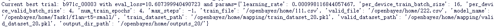

# STA323 Project 2
SID: 12110613  
Name: 任嘉熙  

----

## Question 1: Question and Answering System

Experimental environment: 
- Based on [OpenBayes](https://openbayes.com/)
- RTX4090 x 2, CPU 40 cores
- PyTorch 2.1

### (1)

In this problem I tried to use Pyspark to preprocess the data to fit the requirements of model training. Through observing the schema of the dataset, I found that there is two parts in the "answers" field, the first part is the text in an array, and the second part is the answer start position in the context. Both parts can contain some null values. The answer start part is useless for the question, so I choosed to drop this attributes only to keep the text part. 

After dropping, I tried to prepare the data to fit the input of the model training, which is concating "question: ", question field, " context: " and context field. The output is just to keep "answers.text". 

After preparing, I checked if there is any NA values in the dataframe. There are 43498 NA values in the output field. This is a little bit confused. But after I checked the information, I found that in the SQuAD v2 dataset, compared with version 1, a part of empty values ​​was added to indicate that the answer could not be found in the given context. Such a dataset was used for training to prevent the model from outputting answers randomly. So I need to keep them in the training dataset. To avoiding empty value in the model tokenizer, I tried to substitude the empty value with "None".

The last step is to shuffle the data to get training and validation dataset. Firstly I tried to calculate the ratio of 5000 and the length of the dataset, and using the ratio to split the training and validation dataset, but after that I found the length of validation dataset is not strictly 5000. So the second trial is to shuffle the dataset and get the first 5000 rows to validation set and the remaining to training set. Checking the sum of the length, I found that it decreases from the origin length. So there maybe some dumplicate values. After checking, there are 23 duplicated rows. It is necessary to filter them out. Finally I wrote them to csv files to prepare the input of model training.

### (2)

In this problem we are required to further funtune the QA model Flan-T5-small on the SQuAD v2 dataset, the reference is to use ray-train python code, but the further requirement is to use the validation set for designing the hyperparameters and selecting the model checkpoint, so I think using **ray-tune** is a better choice than ray-train.

- ***Preprocessing Function***: In this function I need to process the input string texts to tokenized vectors as the model can not directly understand the string texts. The strategy chosen in the tokenizer is *over-length truncation* and *under-completion* which refer to the keyword  `truncation` and `padding` to ensure that all input vectors are of the same length for batch input, and the returned vector is "pt", which means that a PyTorch form of the tensor is used.

- ***Train Function***: This is the key function in this problem, all of the training details are in this function. The tokenizer is load from the local because it's hard to connect to huggingface in China. Then using the `preprocess_function` to prepare the string inputs to tokenized inputs, in order to facilitate the later parallel tuning steps and be able to run in one script, I chose to process the data for the first time will be processed in the form of pkl stored locally, in the next run of the script will be given priority to check whether there is a local tokenized data, if there is a local load directly from the local, skipping the map phase to save time. This is just the thought of such process, and there are actually more automated tools available for processing (truncation and padding) and batching of data. `DataCollatorForSeq2Seq` is used to process such operations, and it will be a parameter of **trainer**. The model loading is also from the local directory as same as the tokenizer. 

    After loading all, I started to define the training arguments in function `Seq2SeqTrainingArguments`. There are a lot of arguments in it, the key ones are "*evaluation_strategy*", "*save_strategy*", "*learning_rate*", "*weight_decay*"(to avoid the overfitting), batch size of train and evaluation, "*save_total_limit*"(setting to one indicates that there will be one checkpoint to be keep, so there may be two checkpoints in the running progress, one for the best and the other for the latest), "*predict_with_generate*"(setting to True because this is a text generating task), "*load_best_model_at_end*" and "*metric_for_best_model*".

    All are defined well, putting all into funciton `Seq2SeqTrainer`, then can start the trainer to train. 

    Then comes the evaluation step, firstly turning the model into evaluating mode by `trainer.evaluate()`, then the loss on validation set can be obtained by `eval_results.get("eval_loss")`. Then I create a tempfile to store the checkpoint of the model and tokenizer, and report the message of metrics and checkpoints to the `session`, the message should look like: <div style="text-align:center"></div>

- ***Tune Transformer***: In this part comes hyperparameters' selection and optimization. There are three key components in this function: parameter search network, reporter and scheduler.

    *Parameter search grid*: This is defined in a dictionary type. There are four field should be searched: learning rate, per device train batch size, number of training epochs and weight decay. To simplify the search space (because don't have enough time and resource to train it on a complex search grid), I just search on learning rate randomly chosen on loguniform from $10^{-5}$ to $10^{-3}$, train batch size randomly chosen from 16 and 32 and number epochs randomly chosen from 2 to 4. The weight decay is set to 0.01. The max steps are set to 1 for smoke test for quickly testing the correctness of the code otherwise -1 which means there is no limit to the maximum number of steps and training will proceed for the number of epochs specified.

    *Reporter*: This is used to report the searching parameters of the trials and the metrics of the trials, the metrics reports are the loss on the validation set, similar as the evaluation step in the session report in the training function. And the searching parameters report should look like: <div style="text-align:center"></div>

    *Scheduler*: In this step I chosed to use `PopulationBasedTraining` which is a advanced scheduler that optimizes the training process by periodically exploring and exploiting hyperparameters. The attributu "time_attr" is for setting when to perform perturbation of training process, I set it to "training_iteration" which means performing it based on the number of epochs. The attribute "perturbation_interval" is set to 2 means performing it after every two epochs. The attribute "hyperparam_mutations" is set to decided which hyperparameters and how performing perturbation on.

Then can start tuning by `tune.run` in function `tune_transformer`by putting every arguments defined before in. The selection of better model is based on *evaluation loss* and *min*. The number of trials means that we can start multiple training processes at the same time, selecting the best model from multiple hyperparameters and preventing the model from overfitting under a particular hyperparameter. The choice of this parameter depends on the amount of resources of the machine used for training, here I just set it to 4 to reduce the training cost and time.

After each trail is finished, the reporter would report the current best trial informations like:
<div style="text-align:center"></div>

After all trials are finished, it would report all trials' informations containing the training time cost and evaluation loss (because I train the model online and download the output model file to local, I forget to get some screenshots of the training results, so I used a quick test of training just 20 rows of input and valid on 10 rows as a example here): 
<div style="text-align:center"></div>

The best trial can also be obtained by the returns of `tune.run`. The best config information should be like this:
<div style="text-align:center"></div>

After take a quick look of the best trial, the finetuning model should be saved to local for further using.

> An interesting problem I encountered during the training process: in the train_func function, I initially set the output_dir as a hyperparameter, i.e., a fixed value, and when I ran multiple trials later, I found that there would always be a trial that was trained as error, and the error message suggested that the parent directory of the checkpoint didn't exist. After some attempts and modifications, my understanding is that I have limited the number of checkpoints to 1, i.e. only the best checkpoint will be retained in each trial, but now it is a distributed parallelization of all the trials, and all the checkpoints are exported to a folder, it will happen that some trials mistakenly delete the checkpoints of the others, resulting in a file. It will happen that some trials will delete the checkpoints of other trials by mistake, which will lead to the loss of files. So the solution is to set a different output_dir for each trial named by ID to ensure the independence between them.

### (3)

In this problem we are required to deploy the finefuned QA model in problem(2) with SparkNLP and answer the questions in a streaming processing manner using Kafka. The difficulty hear is to combine the two different systems SparkNLP and Kafka together. SparkNLP also provides a SparkSession, which is started through `sparknlp.start`, but it is difficult to import the Kafka framework into this SparkSession, so I chose to use the SparkSession in pyspark to integrate the sparknlp and Kafka frameworks together. The code as follows:

```python
spark = SparkSession.builder \
      .appName("Spark NLP") \
      .master("local[*]") \
      .config("spark.driver.memory", "16G") \
      .config("spark.serializer", "org.apache.spark.serializer.KryoSerializer") \
      .config("spark.kryoserializer.buffer.max", "2000M") \
      .config("spark.driver.maxResultSize", "0") \
      .config("spark.jars.packages", "com.johnsnowlabs.nlp:spark-nlp_2.12:5.3.3") \
      .config("spark.jars", "/shareddata/lab09/kafka-clients-3.5.0.jar,/shareddata/lab09/spark-sql-kafka-0-10_2.12-3.5.0.jar,/shareddata/lab09/spark-token-provider-kafka-0-10_2.12-3.5.0.jar,/shareddata/lab09/commons-pool2-2.12.0.jar") \
      .getOrCreate()
```

But in the next few steps I found that there is no need for using SparkSession to read the streaming data from Kafka, instead, doing the model inference in the "consumer". So the problem can be devided into three parts: *transform the best model into Spark-NLP model*, *Kafka producer to send the questions in streaming*, *Kafka consumer to answer the question*.

- ***Transformation***: I completed this part by referring to [a tutorial in Colab](https://colab.research.google.com/github/JohnSnowLabs/spark-nlp/blob/master/examples/python/transformers/onnx/HuggingFace_ONNX_in_Spark_NLP_T5.ipynb#scrollTo=P7nXnxLc5zQV) of "Import ONNX T5 models from HuggingFace into Spark NLP". The first step is to export the model to ONNX using optimum by a bash script:
    ```bash
    ! optimum-cli export onnx --task text2text-generation-with-past --model {MODEL_NAME} {EXPORT_PATH}
    ```
    Then we should move the sentence piece models `spiece.model` from the tokenizer to assets folder which Spark NLP will look for. The last step is to start Spark with Spark NLP and use `loadSavedModel` function in `T5Transformer` which allows us to load the ONNX model. Setting the task to "qa:", and saving the loading model to Spark NLP model. Then we can use the model directly from funciton `T5Transformer.load`.

- ***Producer***: The "Producer" is simple, we only need to encode the information of each line in csv into json format and send the message through the `send` method of KafkaProducer. Set the interval between each message to 0.5s to prevent excessive concurrency, and `producer.flush()` to ensure that all messages are sent.

- ***Consumer***: In "Consumer" we need to load the previously saved Spark NLP model first for later inference.The inference of the model is done as a pipeline, first we need to convert the raw text data to document format using `DocumentAssembler`, set the column names of the inputs and outputs, and then load the trained model using ` T5Transformer.load` to load the trained model to accept the output of the previous pipeline and predict the answer. The work that "Consumer" needs to do is to decode the streaming data from "Producer", use the decoded text as the input of the pipeline, and finally output the answer normally. The output should be like: <div style="text-align:center"></div>

### (4)

RAG combines the information retrieval stage and answer generation stage in a differential manner. It uses a combination of parametric memory which can be a pre-trained model like seq2seq BART and non-parametric memory such as dense vector representations of Wikipedia articles indexed with some online library like FAISS libiary. The **pipeline** is: RAG first encodes a question into a dense representation, retrieves the relevant passages from an indexed Wikipedia knowledge base and then feeds them into the generator to get the answers. And the loss function can finetune both the generator and the question encoder at the same time. The **system diagram** should look like: 
<div style="text-align:center"></div>

## Question 2: Startup Analysis

I choose Snowflake to do the SWOT analysis.

***The Product Description***: Snowflake Inc. offers the Snowflake Data Cloud, a cloud-based data warehousing platform designed for managing and analyzing large volumes of data across multiple cloud environments. With its cloud-native architecture, Snowflake provides scalability, flexibility, and performance, operating seamlessly on major cloud providers like AWS, Azure, and GCP. Its unique multi-cluster shared data architecture enables efficient resource management and high performance for diverse workloads. Snowflake facilitates secure data sharing and collaboration, complies with stringent security and compliance standards, and supports various data types, making it a comprehensive solution for modern data analytics.

***The SWOT analysis***: 

- *Strength*: 
    - Rapid Revenue Growth and Market Expansion: Snowflake Inc. has demonstrated a robust revenue growth of 35.8% from 2023 to 2024, with its revenue climbing to $2.8 billion in 2024 from $2.1 billion in 2023. This growth highlights the strong market demand for Snowflake's cloud-based data solutions and validates its effective go-to-market strategy.
    - Advanced Technology: Snowflake's innovative platform supports a variety of workloads, including data warehousing, data lakes, and AI/ML applications. Its high-performance capabilities, robust security features, and ease of use make it a preferred choice for customers seeking comprehensive and powerful data warehousing solutions.
    - Strong Investment in Research and Development: With significant R&D investments totaling $1.3 billion in 2024, Snowflake continuously enhances its platform. This focus on innovation allows the introduction of new features and capabilities, strengthening its product offerings and competitive edge in the rapidly evolving data services industry.
    - Strategic Partnerships: Collaborations with major cloud providers like AWS, Microsoft Azure, and Google Cloud Platform enable seamless integration for customers. This partnership ecosystem extends Snowflake's reach and enhances its service offerings, providing a more comprehensive solution to its clientele.
    - Market Position and Brand Recognition: Snowflake enjoys a strong market position and brand recognition, underscored by its ranking as first in Forbes Cloud 100. This recognition is a testament to the company's innovative approach and the value it delivers to its customers.

- *Weaknesses*: 
    - History of Operating Losses: Despite impressive revenue growth, Snowflake has yet to achieve profitability, reporting a net loss of $836.1 million in 2024. Aggressive spending on sales, marketing, and R&D has contributed to these losses, raising concerns about the company's path to profitability.
    - Dependence on Third-Party Cloud Providers: Snowflake relies heavily on cloud infrastructure providers such as AWS, Azure, and GCP to operate its platform. This dependency exposes Snowflake to risks associated with outages, price changes, or policy modifications by these providers.
    - Pricing Model Complexity: Snowflake's consumption-based subscription model, while attractive to larger enterprises, can be confusing and less accessible for smaller companies and startups with limited budgets. Approximately 25% of customers report confusion or dissatisfaction with Snowflake's pricing structure.
    - Limited Presence in Emerging Markets: Snowflake has a limited geographic reach, primarily focusing on North America and Europe. Less than 10% of its revenue comes from emerging markets, indicating a potential area for expansion but also a current limitation in its growth potential.

- *Opportunities*:
    - Expanding Global Cloud Market: The global shift towards digital transformation and cloud adoption presents significant opportunities for Snowflake to expand its customer base and increase market share. Emerging markets such as India and Brazil are experiencing significant growth in cloud adoption.
    - Diversifying Service Offerings: There is a growing demand for advanced data services beyond traditional data warehousing. By expanding its service offerings to include advanced analytics, machine learning, and artificial intelligence capabilities, Snowflake can attract a wider range of customers and drive revenue growth.
    - Strategic Partnerships and Acquisitions: Forming partnerships or making strategic acquisitions can help Snowflake access new markets and technologies, strengthen its competitive position, and drive growth in the rapidly evolving cloud services market.

- *Threats*:
    - Intense Competition: Snowflake faces intense competition from major players like AWS, Azure, and GCP, which offer similar services with substantial financial resources and established customer bases. Additionally, emerging data analytics and warehousing startups pose a competitive threat.
    - Economic Uncertainty and Market Volatility: Economic factors such as inflation, interest rate fluctuations, and global market instability can impact Snowflake and its customers. Organizations may reduce their cloud spending or delay digital transformation initiatives in response to economic pressures, potentially affecting Snowflake's revenue growth and expansion plans.
    - Regulatory Compliance: Snowflake must comply with various regulations related to data privacy and security, such as GDPR in Europe and CCPA in California. Any security breach or failure to comply with these regulations can result in hefty fines, legal penalties, and significant damage to Snowflake's reputation and financial performance.

***From the Interview***: The interviews with Snowflake executives provide valuable insights into strategic priorities. Innovation, particularly in AI and machine learning, is emphasized for enhancing platform capabilities and expanding into new markets like Asia and Latin America. A customer-centric approach and strategic partnerships are highlighted for driving market adoption and ecosystem growth. Snowflake's focus on competitive differentiation through architecture, performance, and customer experience underscores its strategic agility and commitment to market leadership.

> **Using ChatGPT**! I use him to build a knowledge base of the company's information and the interviews' content, and then ask him to summarize the company's key informations and the key points in the interviews. After that, I continue to collect the information of the company's financial status and the market status to help me to make a decision of investing in Snowflake. Finally I use my own words to summarize my findings and feed it to ChatGPT to let him improve my summary.   
**SOME FAILURES**: Because I'm using GPT3.5 and limited GPT4o, he can't access to the internet, so at first he doesn't know the company Snowflake, so I need to build a knowledge base for him to avoid generating fake informations. The second is I found that ChatGPT tends to generate answers point by point, so I need to summarized them by myself.


## Question 3: Paper Reading

The paper I choose to read is [Spark SQL: Relational Data Processing in Spark](https://people.csail.mit.edu/matei/papers/2015/sigmod_spark_sql.pdf). Here is the report:

The advent of big data has necessitated the development of efficient data processing systems capable of handling vast volumes of data. One such significant advancement is Spark SQL, a novel module integrated into Apache Spark, designed to seamlessly combine relational data processing with Spark's functional programming API. 

The critical issue in the big data landscape is that there exist disjunction between relational query interfaces and procedural programming models. Traditional big data systems, such as MapReduce, predominantly offer procedural programming capabilities, which can be cumbersome for complex data manipulations. On the other hand, relational systems like Hive and Pig provide declarative query interfaces but lack the flexibility of procedural APIs. Spark SQL bridges this gap by integrating relational processing capabilities with Spark's robust procedural API, thereby enhancing the efficiency and flexibility of data processing tasks.

The central hypothesis of Spark SQL is that the integration of relational processing with procedural programming can significantly improve both the efficiency and flexibility of big data processing systems. This integration is realized through the introduction of the DataFrame API and the Catalyst optimizer. The DataFrame API allows users to perform relational operations on distributed collections of data, while the Catalyst optimizer leverages the advanced features of the Scala programming language to provide extensible query optimization capabilities.

The key contibutions of this work include that the development of the DataFrame API, which seamlessly combines relational operations with Spark's functional programming model, and the design and implementation of the Catalyst optimizer, which provides a flexible and extensible framework for query optimization, it also demonstrates the enhanced performance and flexibility of Spark SQL compared to traditional SQL-on-Hadoop systems.

Spark SQL builds on a rich legacy of research in the field of data processing systems. Notable antecedents include Shark, an earlier attempt to bring SQL capabilities to Spark; Apache Hive, which offers SQL-like query capabilities on Hadoop; Apache Pig, which provides a high-level platform for creating MapReduce programs; and Dremel, Google's large-scale data analysis system. Researchers such as Michael Armbrust, Reynold S. Xin, and Cheng Lian have made significant contributions to this domain, particularly in the development of scalable and efficient data processing frameworks.

To validate the effectiveness of Spark SQL, comprehensive experiments were designed and executed. These experiments involved running Spark SQL on various large-scale datasets, including the TPC-DS benchmark datasets commonly used in Hive. The performance of Spark SQL was benchmarked against other systems to evaluate its efficiency and scalability. The experiments were meticulously crafted to ensure that the results were quantifiable and reproducible, adhering to rigorous scientific standards.

The experimental results robustly support the hypothesis that Spark SQL can significantly outperform traditional SQL-on-Hadoop systems. The performance benchmarks demonstrated that Spark SQL not only provided faster query execution times but also offered greater flexibility in handling complex analytical workloads. The DataFrame API's versatility and the Catalyst optimizer's effectiveness were critical factors contributing to these superior performance metrics.

The contributions of Spark SQL to the field of big data processing are manifold. By integrating relational and procedural processing, Spark SQL provides a unified framework that simplifies complex data manipulations and enhances performance. The DataFrame API allows users to leverage the simplicity of relational operations while maintaining the power of procedural programming. The Catalyst optimizer introduces a new paradigm in query optimization, offering an extensible and efficient framework that can adapt to various data processing needs.

Building on the foundation laid by Spark SQL, several promising avenues for future research and development emerge. Enhancing the Catalyst optimizer by incorporating additional optimization rules and supporting a wider array of data types can further boost Spark SQL's performance. Integrating the DataFrame API more deeply with other Spark components, such as GraphX and Spark Streaming, can provide a more cohesive and powerful data processing ecosystem. Additionally, exploring real-world application scenarios to identify and implement further performance optimizations will be crucial in advancing Spark SQL's applicability and efficiency.